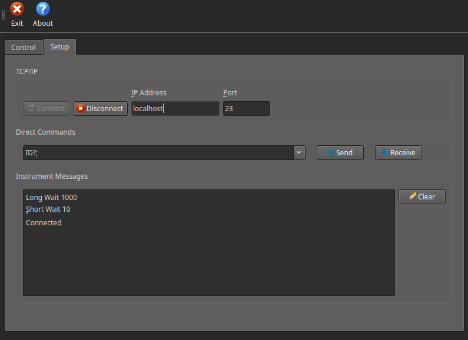
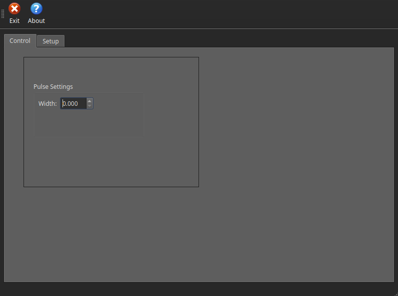

# VFP - Virtual Front Panel

A simple Qt application that can connect to an Instrument or a Server using TCP/IP connection and can send and receive messages from it.

You can use [echo-server](https://github.com/omarbassam88/echo-server) to test the connection.

This was originally done for educational purposes following the Plural Sight Tutorial by Tod Gentille.

[Introduction to Qt: A C++ Cross Platform Application Framework](https://app.pluralsight.com/library/courses/introduction-qt-cplusplus-framework/table-of-contents)

## System Requirements

- Qt6
- CMake >3.5

